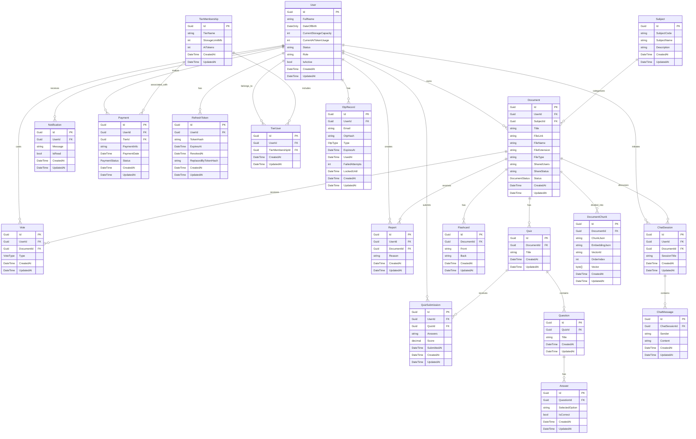

# AI Study Hub

AI Study Hub is an ASP.NET Core 8 Web API for AI-assisted learning document management. The system is designed around a clean MVC 3-layer architecture with SQL Server persistence, JWT authentication, Swagger documentation, validation, mapping, logging, repositories, and Unit of Work.

## Tech Stack

- ASP.NET Core 8 Web API
- SQL Server
- Entity Framework Core 8 Code First
- Swagger / OpenAPI
- JWT Authentication
- AutoMapper
- FluentValidation
- Serilog
- Repository Pattern
- Unit of Work Pattern

## Architecture

The solution uses exactly 3 layers:

```text
Client
→ AIStudyHub.API
→ AIStudyHub.Business
→ AIStudyHub.Data
→ SQL Server
```

Projects:

- `AIStudyHub.API`: Presentation layer, controllers, middleware, Swagger, JWT, API dependency registration.
- `AIStudyHub.Business`: Business layer, entities, DTOs, enums, service contracts, services, validators, mappings.
- `AIStudyHub.Data`: Data access layer, DbContext, repositories, Unit of Work, EF configurations, migrations, seed data.

## Main Modules

- Authentication
- User Management
- Document Management
- Document Search
- Document Voting
- Document Reporting
- AI Chat
- Flashcard Generation
- Quiz Generation
- Quiz Submission
- Notification
- Payment
- Admin

## Solution Structure

```text
AIStudyHub.slnx
├── AIStudyHub.API
├── AIStudyHub.Business
├── AIStudyHub.Data
├── docs
│   ├── AGENT.md
│   └── ARCHITECTURE.md
├── .gitignore
└── README.md
```

## Prerequisites

- .NET 8 SDK
- SQL Server
- Visual Studio 2022, Rider, or VS Code
- EF Core CLI tools

Install EF Core tools if needed:

```bash
dotnet tool install --global dotnet-ef
```

## Configuration

Runtime settings are intentionally not committed.

Create your local configuration file from the example:

```bash
copy AIStudyHub.API\appsettings.example.json AIStudyHub.API\appsettings.json
```

Default connection string in the example file:

```json
{
  "ConnectionStrings": {
    "DefaultConnection": "Server=localhost;Database=AIStudyHub;Trusted_Connection=True;TrustServerCertificate=True;"
  }
}
```

JWT settings are stored under the `Jwt` section in your local `AIStudyHub.API/appsettings.json`.

Do not commit real environment configuration. Use user secrets, environment variables, or a secure secret store for production values.

## Getting Started

Restore dependencies:

```bash
dotnet restore AIStudyHub.slnx
```

Build the solution:

```bash
dotnet build AIStudyHub.slnx
```

Run the API:

```bash
dotnet run --project AIStudyHub.API
```

Open Swagger:

```text
https://localhost:{port}/swagger
```

or, when running with a fixed URL:

```bash
dotnet run --project AIStudyHub.API --urls http://localhost:5000
```

Swagger:

```text
http://localhost:5000/swagger
```

## Database Migrations

Create a migration:

```bash
dotnet ef migrations add InitialCreate --project AIStudyHub.Data --startup-project AIStudyHub.API
```

Apply migrations:

```bash
dotnet ef database update --project AIStudyHub.Data --startup-project AIStudyHub.API
```

## API Documentation

Swagger is configured in the API project and enabled in development mode.

Main API groups:

- `/api/Auth`
- `/api/User`
- `/api/Document`
- `/api/Quiz`
- `/api/Flashcard`
- `/api/Vote`
- `/api/Report`
- `/api/Notification`
- `/api/Payment`
- `/api/Chat`
- `/api/Admin`

## Database Entity Model (ER Diagram)

The database schema is based on Entity Framework Code First. The core tables and their relationships are represented below:



## Security Notes

- JWT Bearer authentication is configured.
- Admin endpoints should use role-based authorization.
- Passwords must be hashed before persistence when authentication logic is implemented.
- Do not expose `PasswordHash` or sensitive fields in DTOs.
- Do not commit real JWT secrets, certificates, payment credentials, or production connection strings.

## Logging

Serilog is configured for:

- Console logging
- Rolling file logs under `logs/`
- Structured request logging
- Global exception logging

Runtime logs are ignored by Git.

## Documentation

Additional project documentation:

- [Agent Guide](docs/AGENT.md)
- [Architecture Reference](docs/ARCHITECTURE.md)

## Current Status

This repository currently contains a production-ready skeleton architecture. Business logic is intentionally not implemented yet.

Service methods are placeholders and should be completed module by module.

## Future Work

- Implement authentication and JWT token generation.
- Add password hashing.
- Implement document upload and storage.
- Implement document search.
- Add AI provider integration for chat, flashcards, and quizzes.
- Add payment gateway integration and webhook verification.
- Generate real EF Core migrations.
- Add unit and integration tests.
- Add rate limiting and health checks.
