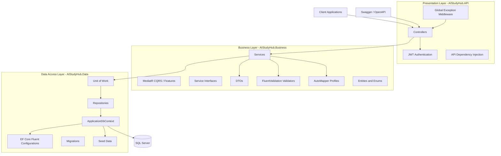
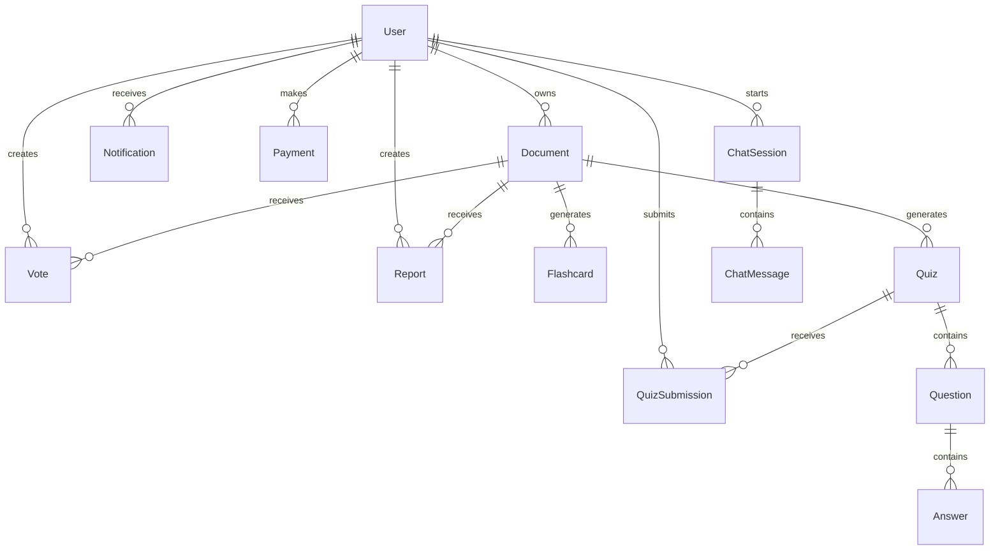
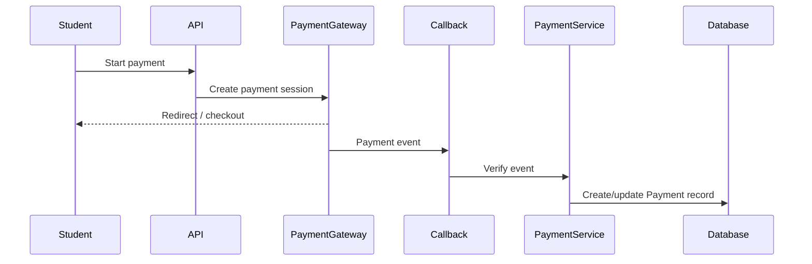

# High Level Architecture

AI Study Hub uses an MVC 3 Layer Architecture with a strict separation between HTTP/API concerns, business rules, and data persistence.



# Solution Structure

```text
AIStudyHub.slnx
├── AIStudyHub.API
├── AIStudyHub.Business
└── AIStudyHub.Data
```

Projects:

- `AIStudyHub.API`: ASP.NET Core 8 Web API presentation layer.
- `AIStudyHub.Business`: business contracts, DTOs, entities, services, validators, mappings, enums.
- `AIStudyHub.Data`: EF Core persistence, DbContext, repositories, Unit of Work, configurations, seed data, migrations.

# Folder Structure

```text
AIStudyHub.API
├── Controllers
├── Extensions
├── Middleware
├── Properties
├── Program.cs
├── appsettings.json
├── appsettings.Development.json
└── AIStudyHub.API.http

AIStudyHub.Business
├── DTOs
│   ├── AIChat
│   ├── Answers
│   ├── Authentication
│   ├── Documents
│   ├── Flashcards
│   ├── Notifications
│   ├── Payments
│   ├── Questions
│   ├── QuizSubmissions
│   ├── Quizzes
│   ├── Reports
│   ├── Users
│   └── Votes
├── Entities
├── Enums
├── Interfaces
│   └── Services
├── Mappings
├── Services
└── Validators
    ├── AIChat
    ├── Answers
    ├── Authentication
    ├── Documents
    ├── Flashcards
    ├── Notifications
    ├── Payments
    ├── Questions
    ├── QuizSubmissions
    ├── Quizzes
    ├── Reports
    ├── Users
    └── Votes

AIStudyHub.Data
├── Configurations
├── Extensions
├── Interfaces
├── Migrations
├── Repositories
├── Seed
└── ApplicationDbContext.cs
```

# Layer Responsibilities

## Presentation Layer

Project: `AIStudyHub.API`

Responsibilities:

- Expose HTTP REST endpoints.
- Host controllers.
- Configure Swagger/OpenAPI.
- Configure JWT authentication.
- Configure global middleware.
- Register dependencies.
- Return HTTP responses.
- Handle API-level concerns only.

Must not:

- Contain business rules.
- Access EF Core directly.
- Return entity classes directly.
- Contain SQL or repository logic.

## Business Layer

Project: `AIStudyHub.Business`

Responsibilities:

- Define entities and enums.
- Define DTOs.
- Define service interfaces.
- Implement services and business workflows.
- Define FluentValidation validators.
- Define AutoMapper profiles.
- Own business rules and orchestration.

Must not:

- Reference ASP.NET Core controller or HTTP-specific types.
- Use `DbContext` directly unless explicitly approved.
- Contain SQL Server-specific implementation details.

## Data Access Layer

Project: `AIStudyHub.Data`

Responsibilities:

- Define `ApplicationDbContext`.
- Define EF Core Fluent API configurations.
- Implement repositories.
- Implement Unit of Work.
- Register persistence dependencies.
- Manage migrations and seed data.
- Persist entities to SQL Server.

Must not:

- Contain business workflows.
- Return DTOs.
- Depend on API controllers.

# Database Design

Database engine: SQL Server.

ORM: Entity Framework Core 8 Code First.

Core entities:

- `User`
- `Document`
- `Vote`
- `Report`
- `Flashcard`
- `Quiz`
- `Question`
- `Answer`
- `QuizSubmission`
- `Notification`
- `Payment`
- `ChatSession`
- `ChatMessage`

Base entity fields:

- `Id`
- `CreatedAt`
- `UpdatedAt`

Entity design rules:

- All entities inherit from `BaseEntity`.
- Navigation properties are defined for relationships.
- Relationships are configured with Fluent API.
- String lengths are explicitly configured.
- Decimal precision is explicitly configured.
- Enums are stored as strings for readability.
- Schema changes must be handled through EF Core migrations.

# Entity Relationships



Cardinalities:

- One `User` has many `Documents`.
- One `User` has many `Votes`.
- One `User` has many `Reports`.
- One `User` has many `Notifications`.
- One `User` has many `Payments`.
- One `User` has many `QuizSubmissions`.
- One `User` has many `ChatSessions`.
- One `Document` has many `Votes`.
- One `Document` has many `Reports`.
- One `Document` has many `Flashcards`.
- One `Document` has many `Quizzes`.
- One `Quiz` has many `Questions`.
- One `Question` has many `Answers`.
- One `Quiz` has many `QuizSubmissions`.
- One `ChatSession` has many `ChatMessages`.

# Request Flow

There are two primary request flows depending on the domain complexity:

Standard Service Flow (Simple CRUD/Domain logic):

```text
Client -> Controller -> Service -> Repository -> DbContext -> SQL Server
```

CQRS Flow via MediatR (Complex Domains like Users & Auth):

```text
Client -> Controller -> MediatR -> Command/Query Handler -> Repository -> DbContext -> SQL Server
```

# Authentication Flow

JWT authentication flow uses ASP.NET Core Identity:

```text
Client -> AuthController -> Identity UserManager/SignInManager -> DbContext
```

# AI Features Flow

Current AI architecture uses a **Local LLM stack** (Ollama) with `nomic-embed-text` for generating vector embeddings locally, and Pinecone for vector storage.

```mermaid
flowchart LR
    Upload[Document Upload (multipart/form-data)]
    Extract[Text Extraction & Chunking (Local)]
    Vector[Vectorization via Ollama]
    Store[Vector Storage via Pinecone]

    Upload --> Extract
    Extract --> Vector
    Vector --> Store
```

Future integrations will expand to:

- Chat interactions leveraging `RagChatService`
- Automated Flashcard and Quiz generation based on stored vectors

All AI interactions ensure that sensitive prompts and data chunks are managed within the backend.

# Payment Flow

Target payment flow:



Linear flow:

```text
Student
→ Payment Gateway
→ Callback
→ Payment Record
```

Payment rules:

- Do not store raw card data.
- Validate webhook signatures when implemented.
- Store provider transaction IDs.
- Store payment status transitions.
- Do not log payment secrets.

# API Structure

Authentication APIs:

- `POST /api/Auth/register`
- `POST /api/Auth/login`

Document APIs:

- `GET /api/Document`
- `GET /api/Document/{id}`
- `POST /api/Document`
- `PUT /api/Document/{id}`
- `DELETE /api/Document/{id}`

Quiz APIs:

- `GET /api/Quiz`
- `GET /api/Quiz/{id}`
- `POST /api/Quiz`
- `PUT /api/Quiz/{id}`
- `DELETE /api/Quiz/{id}`
- Future: question, answer, and submission endpoints can be split into dedicated controllers when needed.

AI APIs:

- `GET /api/Chat/sessions`
- `POST /api/Chat/sessions`
- `GET /api/Chat/sessions/{sessionId}/messages`
- `POST /api/Chat/messages`
- Future: flashcard generation and quiz generation endpoints.

Admin APIs:

- `GET /api/Admin/dashboard`
- Future: moderation, reports, users, payments, and audit endpoints.

Other module APIs:

- `UserController`
- `VoteController`
- `ReportController`
- `FlashcardController`
- `NotificationController`
- `PaymentController`

# Coding Standards

- Use C# 12-compatible style where supported by .NET 8.
- Use nullable reference types.
- Prefer async APIs for I/O.
- Include `CancellationToken` in async controller, service, and repository methods.
- Use constructor injection.
- Keep controllers thin.
- Keep service methods focused on one use case.
- Return DTOs from services and controllers.
- Do not expose entities from API responses.
- Use PascalCase for public members and types.
- Use camelCase for locals and parameters.
- Use explicit access modifiers.
- Avoid static state for request-specific behavior.
- Avoid circular project references.

# Dependency Injection Strategy

DI registration locations:

- API services: `AIStudyHub.API/Extensions/ServiceCollectionExtensions.cs`
- JWT: `AIStudyHub.API/Extensions/JwtExtensions.cs`
- Swagger: `AIStudyHub.API/Extensions/SwaggerExtensions.cs`
- Data access: `AIStudyHub.Data/Extensions/DataAccessExtensions.cs`

Lifetimes:

- Controllers: framework-created.
- Services: scoped.
- Repositories: scoped.
- Unit of Work: scoped.
- DbContext: scoped.
- Validators: registered from assembly.
- AutoMapper: registered from Business assembly.

Rules:

- Register abstractions, not only concrete classes.
- Business services should depend on interfaces.
- Data access should be hidden behind repository and Unit of Work abstractions.
- Avoid singleton services that depend on scoped dependencies.

# Error Handling Strategy

Global exception handling is centralized in `GlobalExceptionMiddleware`.

Rules:

- Controllers should not use broad try/catch blocks.
- Validation failures should return `400 BadRequest`.
- Authentication failures should return `401 Unauthorized`.
- Authorization failures should return `403 Forbidden`.
- Missing resources should return `404 NotFound`.
- Unexpected failures should return `500 InternalServerError`.
- Production error responses must not expose stack traces.
- Error responses should be consistent JSON payloads.

# Logging Strategy

Logging provider: Serilog.

Configuration file: `AIStudyHub.API/appsettings.json`.

Rules:

- Use structured logging.
- Use request logging middleware.
- Log unhandled exceptions in global exception middleware.
- Add contextual logs around important workflows when implemented.
- Do not log:
  - Passwords
  - Password hashes
  - JWTs
  - API keys
  - Payment secrets
  - Raw card data
  - Private document contents
  - Sensitive AI prompts or chat contents unless explicitly sanitized

Recommended log levels:

- `Information`: normal business events.
- `Warning`: suspicious or recoverable issues.
- `Error`: failed operations requiring investigation.
- `Debug`: local development diagnostics only.

# Future Scalability

Recommended evolution paths:

- Add caching for frequently accessed public document metadata.
- Add full-text search or external search service for document search.
- Add vector database or embedding store for AI retrieval.
- Add background jobs for document processing, vectorization, flashcard generation, and quiz generation.
- Add message queue for long-running AI and payment workflows.
- Add object storage for uploaded documents.
- Add audit logging for admin and payment actions.
- Add rate limiting for auth, upload, search, and AI endpoints.
- Add API versioning before public clients depend on the API.
- Add integration tests with a test database.
- Add health checks for SQL Server and external providers.
- Add observability with metrics and distributed tracing.
- Split AI provider and payment provider implementations behind interfaces.
- Keep the current 3-layer architecture unless scaling requirements justify a larger architecture.
